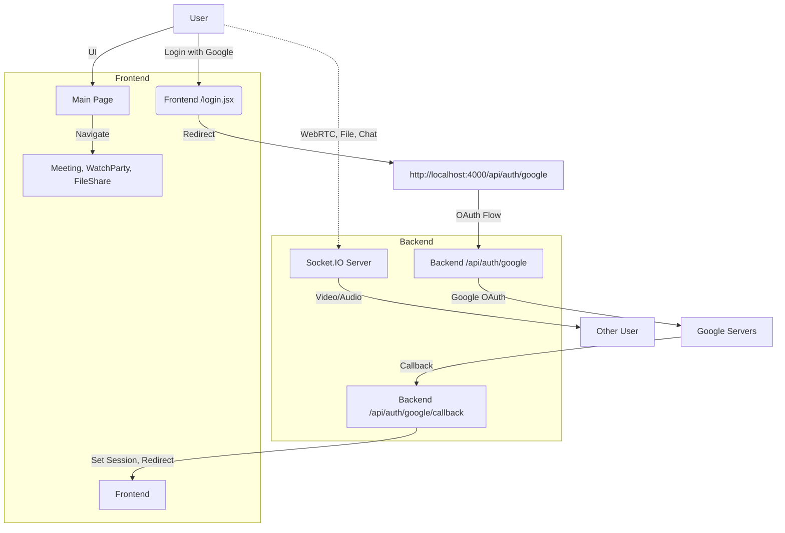
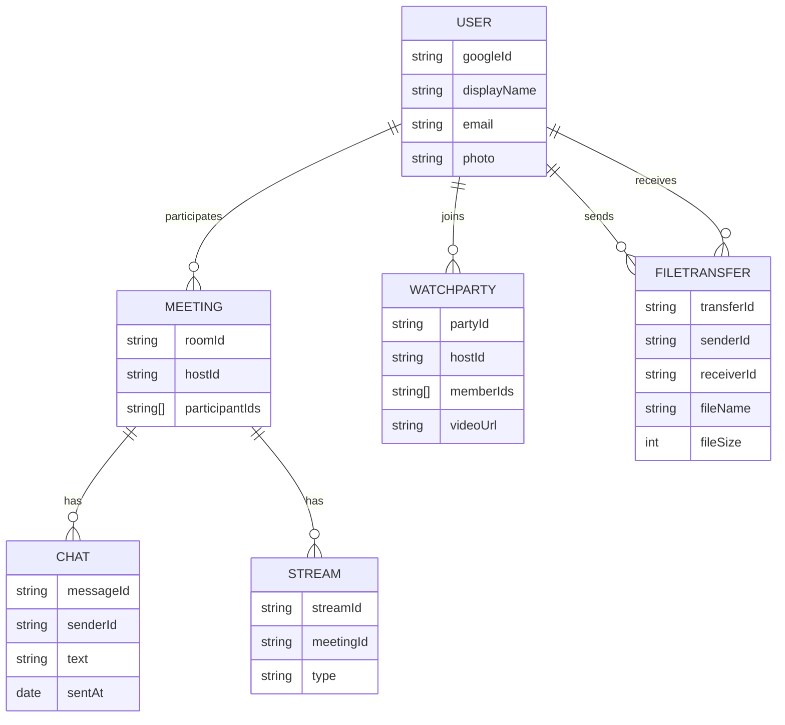
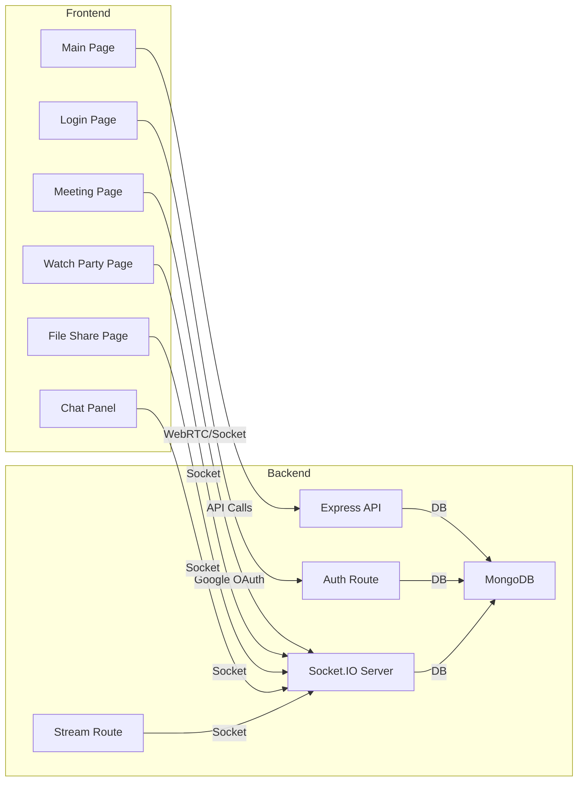

# VideoStreamer: Modern Video Meeting, Watch Party & File Sharing Platform


---

## 🚀 Overview

**VideoStreamer** is a full-stack web application for real-time video meetings, collaborative YouTube watch parties, and secure file sharing. It features Google OAuth authentication, WebRTC-based video calls, live chat, and a modern, responsive UI.

---

## ✨ Features

- **Google OAuth Login**
- **Virtual Meetings** (WebRTC, video/audio, chat, screen share)
- **Watch Party** (synchronized YouTube viewing)
- **File Transfer** (peer-to-peer, chunked, secure)
- **Live Chat** (in meetings)
- **Responsive UI** (Material UI, Tailwind)
- **User Profiles**

---

## 🏗️ Architecture

### System Flow



### Entity Relationship



### Component/Service Overview



---

## 🛠️ Setup & Installation

### Prerequisites
- Node.js 18+
- MongoDB 6+
- Redis (for session store)

### 1. Clone the repository
```bash
git clone <repo-url>
cd videostreamer/streamer
```

### 2. Install dependencies
```bash
npm install
cd backend && npm install
```

### 3. Environment Variables
Create a `.env` file in `backend/`:
```
SESSION_SECRET=your_session_secret
uri=mongodb://localhost:27017/yourdbname
googleId=your_google_client_id
googleSecret=your_google_client_secret
```

### 4. Start the servers
- **Backend:**
  ```bash
  cd backend
  node index.js
  ```
- **Frontend:**
  ```bash
  cd ..
  npm start
  ```

---

## 🧑‍💻 Usage
- Visit [http://localhost:3000](http://localhost:3000)
- Login with Google
- Start or join a meeting, watch party, or file share

---

## 📚 API & Socket Endpoints

### Auth API
- `GET /api/auth/google` — Start Google OAuth
- `GET /api/auth/google/callback` — OAuth callback
- `GET /api/auth/logout` — Logout
- `GET /api/auth/current_user` — Get current user

### Socket Events
- `room-join`, `otheroom-join` — Join rooms
- `user-call`, `incoming-call`, `call-accepted` — WebRTC signaling
- `chat-message` — Send/receive chat
- `call-ended` — End call
- `send-chunk`, `receive-chunk` — File transfer

---

## 🖥️ Main Pages
- `/` — Main landing page
- `/login` — Google login
- `/meetinglobby` — Meeting lobby
- `/meeting` — Video meeting
- `/watchparty` — Watch party
- `/fileshare` — File sharing

---

## 🤝 Contributing
Pull requests welcome! For major changes, open an issue first to discuss what you would like to change.

---

## 📄 License
[MIT](LICENSE)
